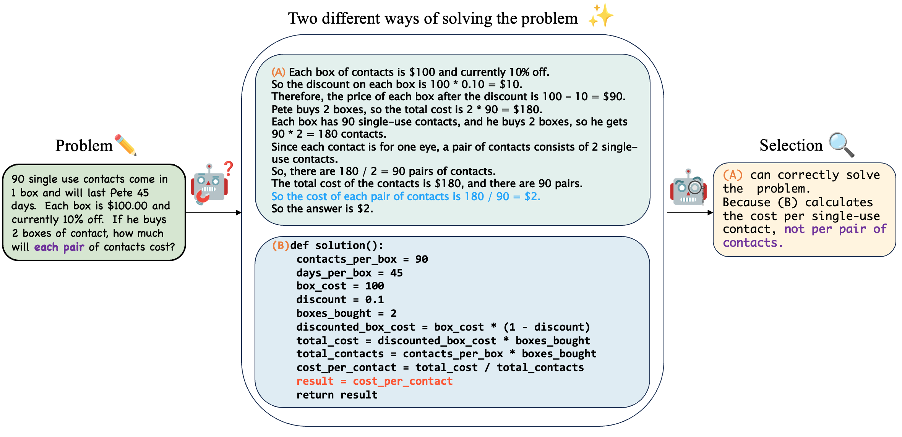

# Automatic Model Selection with Large Language Models for Reasoning



This repository contains code, prompts and dataset for the paper: [Automatic Model Selection with Large Language Models for Reasoning](https://aclanthology.org/2023.findings-emnlp.55.pdf). We propose to perform model selection to combine two distinct methods, CoT and PAL. The proposed algorithm is illusrated in the above figure.

## News

* 🦙 [12/24/2023] We updated math prompts for Llama 2 models in `src/prompts/llama_math_prompt.py`.
* 🎉 [10/08/2023] Our paper was accepted by EMNLP 2023 Findings.
* 🔥 [06/23/2023] We achieved the new SOTA results on GSM8K, with accuracy of 96.8% using GPT-4 and Self-Concsistency (K=15).
* 📣 [06/23/2023] We released the code and data.

## Setup

To beigin with, you need to have an OpenAI [API Key](https://platform.openai.com/account/api-keys). As OpenAI has discountinued public access to Codex, you can apply for [research access](https://openai.com/form/researcher-access-program) to Codex (code-davinci-002). Alternatively, you may opt to use other backbones like ChatGPT and GPT-4.

**Dataset**: Our experiments use seven arithmetic datasets and one date understanding dataset, all of which are located in the `dataset` folder. You may also download these datasets from their respective online sources and format them accordingly.

**Package requirement:** ``pip install openai``

## Running

You can run the code using the following command. We provide an example here that conducts experiments on the arithmetic dataset.

```
python src/selection_math.py --start [start index] --end [end index] --dataset [dataset name] --backbone [ChatGPT or GPT-4] --cot_temperature [0 for greedy decoding, 0.5 for SC] --pal_temperature [0 for greedy decoding, 0.8 for SC] --sc_num [1 for greedy decoding. Others indicate SC samples.] --output_dir [output dir name] --key [OpenAI API Key]
```

Alternatively, you may utilize the script in the `scripts` directory:

* For greedy decoding: ``sh scripts/{codex chatgpt gpt4}/run_{dataset}.sh``
* For self-consistency: ``sh scripts/{codex chatgpt gpt4}/run_gsm8k_sc.sh``

**Note**: Please ensure that you define `EXEHOME` and `APIKEY` in the script before execution.

OpenAI has [rate limits](https://platform.openai.com/docs/guides/rate-limits) for free trail users, which will affect the execution time. To circumvent this, you can upgrade your account with payment methods.

## Evaluating

After running experiments, you can use the following command to evaluate the results:

``sh evaluate_{math date}.sh``

Please ensure that `INPUTPATH` is defined in the script prior to execution.

## Inquiries

Thanks for your interest! Should you have any questions, please reach out to [xu.zhao@u.nus.edu](mailto:xu.zhao@u.nus.edu).

## Citation

```bibtex
@inproceedings{zhao-etal-2023-automatic,
    title = "Automatic Model Selection with Large Language Models for Reasoning",
    author = "Zhao, James  and
      Xie, Yuxi  and
      Kawaguchi, Kenji  and
      He, Junxian  and
      Xie, Michael",
    editor = "Bouamor, Houda  and
      Pino, Juan  and
      Bali, Kalika",
    booktitle = "Findings of the Association for Computational Linguistics: EMNLP 2023",
    month = dec,
    year = "2023",
    address = "Singapore",
    publisher = "Association for Computational Linguistics",
    url = "https://aclanthology.org/2023.findings-emnlp.55",
    doi = "10.18653/v1/2023.findings-emnlp.55",
    pages = "758--783",
    abstract = "Chain-of-Thought (CoT) and Program-Aided Language Models (PAL) represent two distinct reasoning methods, each with its own strengths. CoT employs natural language, offering flexibility and interpretability, while PAL utilizes programming language, yielding more structured and rigorous logic. We introduce a model selection method to combine the best of both worlds by employing a large language model (LLM) to dynamically select between them. Our theoretical analysis underscores the feasibility of this method, which is further corroborated by empirical results. Our proposed method demonstrates significant performance improvements across eight reasoning datasets with Codex, ChatGPT, and GPT-4. Additionally, our method is complementary to self-consistency; when integrated, it can further enhance performance while significantly reducing computation costs. Moreover, we achieve new state-of-the-art results on GSM8K and SVAMP, with respective accuracies of 96.8{\%} and 93.7{\%}.",
}

```
